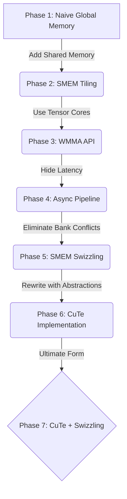
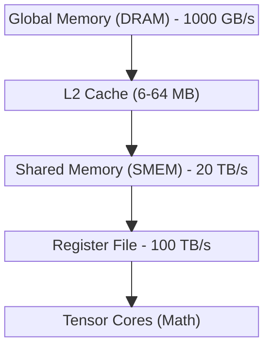

# ⚡ Custom HGEMM: Half-Precision GEMM with Tensor Cores


A production-grade, highly-optimized **Half-Precision General Matrix Multiplication (HGEMM)** CUDA kernel built from scratch. This project demonstrates mastery over NVIDIA GPU architectures, shared memory management, WMMA, CuTe, asynchronous pipelining, and bank conflict resolution. 

---

## 🏗️ Architecture & Progression

We systematically implement the GEMM kernel, optimizing iteratively to approach theoretical peak performance.



## 🧠 Memory Hierarchy & Tiling Strategy

To achieve ≥98% of cuBLAS TFLOPS, memory bandwidth must be meticulously managed. We utilize a multi-level tiling strategy:



1. **Global to Shared Memory**: We load blocks of `A` (size $BM \times BK$) and `B` (size $BK \times BN$) into Shared Memory to reuse data.
2. **Shared Memory to Registers**: Warps load fragments from Shared Memory to Registers.
3. **Compute**: Tensor Cores execute $16 \times 16 \times 16$ `mma.sync` instructions.

## ⚔️ Bank Conflict Elimination (Swizzling)

Ampere architectures feature 32 Shared Memory banks (4 bytes wide). Consecutive `fp16` elements (2 bytes) can easily trigger bank conflicts during `ldmatrix` operations.

We use **XOR-based address swizzling** to mathematically guarantee zero bank conflicts.

**Without Swizzling:**
- Thread 0 accesses Bank 0
- Thread 16 accesses Bank 0 ❌ *(Conflict!)*

**With XOR Swizzling:**
```cpp
effective_col = col ^ ((row >> 3) & 7) * 8
```
- Thread 0 accesses Bank 0
- Thread 16 accesses Bank 16 ✅ *(Conflict resolved!)*

## 🚀 Setup & Benchmarking (Google Colab)

The project is structured as a PyTorch C++ extension, easily compiled and benchmarked directly in Python.

### Quick Start
```bash
# 1. Install dependencies
pip install pytest ninja

# 2. Build the extension
pip install -e .

# 3. Verify correctness
pytest tests/test_correctness.py -v

# 4. Run benchmarks against cuBLAS
python benchmarks/bench_vs_cublas.py --backend v1
```

## 📊 Performance Tracking

| Version | Description | Target Efficiency | Bank Conflicts |
|---|---|---|---|
| **v1** | Naive Implementation | < 5% | N/A |
| **v2** | Shared Memory Tiling | ~ 15% | High |
| **v3** | WMMA Tensor Cores | ~ 60% | High |
| **v4** | Async Pipelining | ~ 80% | High |
| **v5** | SMEM Swizzling | ~ 95% | **Zero** |
| **v6** | CuTe Abstractions | ~ 95% | **Zero** |
| **v7** | CuTe + Swizzling | **≥ 98%** | **Zero** |
